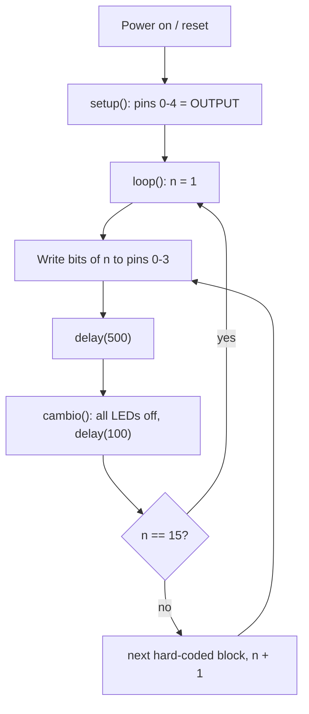

# Code Overview

[← Back to README](../README.md)

This document explains the original sketch without modifying it.

**File:** [`src/NumerosBinarios1_15/NumerosBinarios1_15.ino`](../src/NumerosBinarios1_15/NumerosBinarios1_15.ino)

## Structure

The sketch has three functions:

| Function | Role |
|----------|------|
| `setup()` | Runs once. Sets pins `0`, `1`, `2`, `3`, `4` to `OUTPUT`. |
| `loop()` | Runs forever. Writes 15 hard-coded LED patterns in sequence. |
| `cambio()` | "Change" (Spanish). Turns pins `0`–`3` `LOW` and waits 100 ms. Called after every pattern. |

## Execution Flow

> The `n` counter is conceptual. The original code has no variable; each number is written out as its own block of four `digitalWrite` calls.

## Bit Mapping

| Pin | Bit | Weight |
|-----|-----|--------|
| 0 | b0 (LSB) | 1 |
| 1 | b1 | 2 |
| 2 | b2 | 4 |
| 3 | b3 (MSB) | 8 |
| 4 | — | configured, never written |

## Truth Table (as implemented)

Verified against every block in the sketch:

| Comment in code | Decimal | Binary (b3 b2 b1 b0) | Pin 3 | Pin 2 | Pin 1 | Pin 0 |
|-----------------|--------:|:--------------------:|:-----:|:-----:|:-----:|:-----:|
| `NUMERO 1`      | 1  | 0001 | L | L | L | H |
| `NUMERO 2`      | 2  | 0010 | L | L | H | L |
| `NUMERO 3`      | 3  | 0011 | L | L | H | H |
| `NUMERO 4`      | 4  | 0100 | L | H | L | L |
| `NUMERO 5`      | 5  | 0101 | L | H | L | H |
| `NUMERO 6`      | 6  | 0110 | L | H | H | L |
| `NUMERO 7`      | 7  | 0111 | L | H | H | H |
| `NUMERO 8`      | 8  | 1000 | H | L | L | L |
| `NUMERO 9`      | 9  | 1001 | H | L | L | H |
| `NUMERO A(10)`  | 10 | 1010 | H | L | H | L |
| `NUMERO B(11)`  | 11 | 1011 | H | L | H | H |
| `NUMERO C(12)`  | 12 | 1100 | H | H | L | L |
| `NUMERO D(13)`  | 13 | 1101 | H | H | L | H |
| `NUMERO E(14)`  | 14 | 1110 | H | H | H | L |
| `NUMERO F(15)`  | 15 | 1111 | H | H | H | H |

## Timing

| Phase | Duration |
|-------|----------|
| Number displayed | 500 ms |
| Blank (`cambio()`) | 100 ms |
| Per number | 600 ms |
| Full cycle (15 numbers) | ≈ 9 s |

`0` (`0000`) is never shown as a number; it only appears as the blank gap between values.

## Dependencies

Only the Arduino core API: `pinMode`, `digitalWrite`, `delay`, `HIGH`, `LOW`, `OUTPUT`. No libraries, no serial communication, no global variables.

## Style Notes (descriptive only)

- Comments are in Spanish and uppercase.
- The file uses Windows (CRLF) line endings.
- There are several blank lines at the beginning of `loop()` and before `cambio()`.

These characteristics are part of the original implementation and are preserved.
